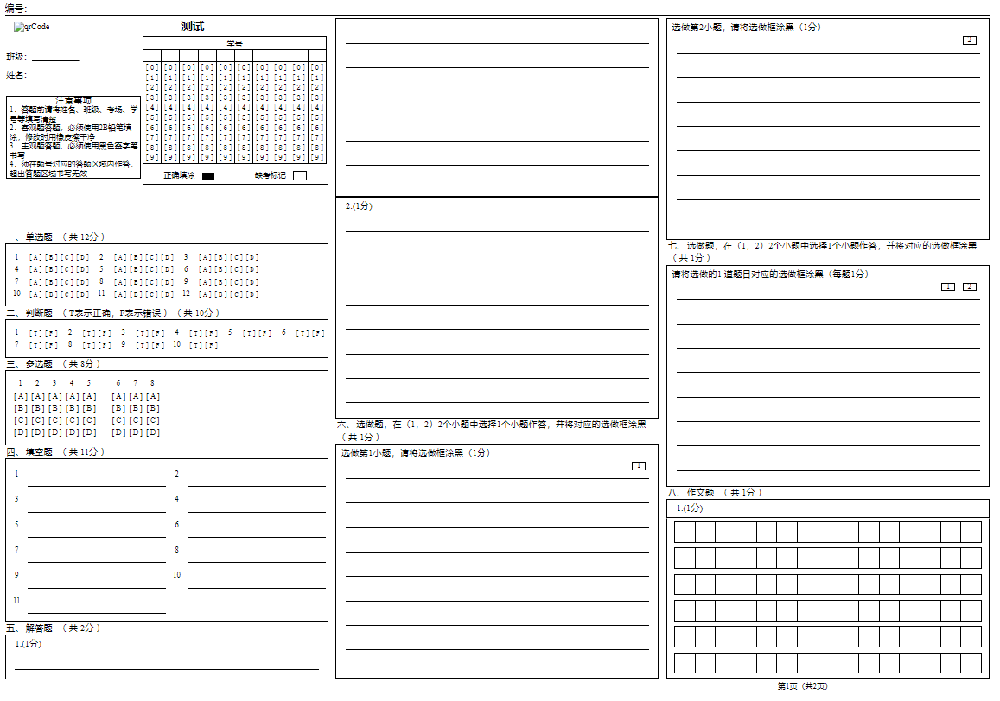
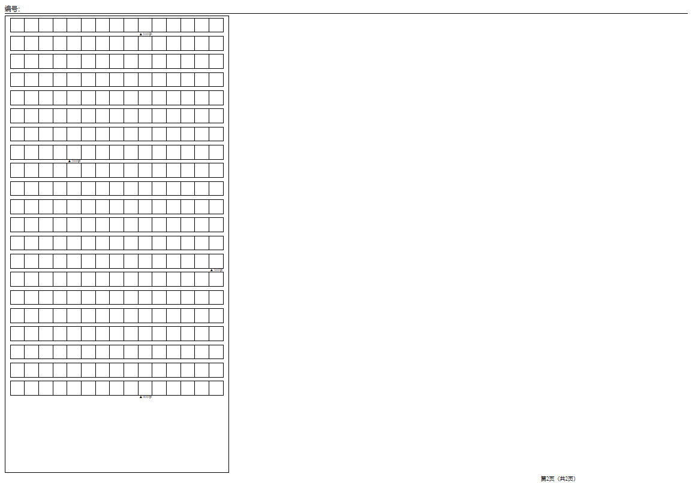

[📘使用文档]() |
[🛠安装教程]() |
[👀模型库]() |
[🆕更新日志]() |
[🚀进行中的项目]() |
[🤔报告问题]()

## 答题卡识别（answer_cards_identification）

### 需求
- **学号识别**
- **客观题识别**
  - 单选题/判断题（选项横排：横排/竖排/混合排、选项竖排）、多选题（选项横排：横排/竖排/混合排、选项竖排）
- **主观题识别**
  - 填空题（横/竖排）、解答题、作文题、选做题    
    
     

### 模块内容
- **quality_judgement**   
   输入图像质量判断，拉普拉斯算法、图像亮度判断、ocr字体匹配
- **correction_module**   
    输入图像矫正模块，1.对输入模块进行矫正 2.对不符合要求图片进行筛选
- **id_recog**      
    学号识别
- **instance**     
    对模板结构化入参实例化
- **objective_questions**   
    客观题识别，1.使用检测方法，对黑色物块以及区域进行检测判断，2.使用ocr对区域进行判断
- **subjective_questions**    
    主观题识别，√×以及数字三类检测，数字进行手写体ocr检测
- **auxiliary**  
    辅助模块，通用ocr...

### 技术路线图
      

### 要求
- **拍照**  
    排单张图片上传，不支持答题卡切割等

