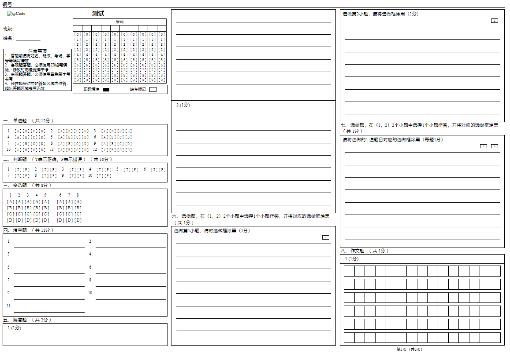
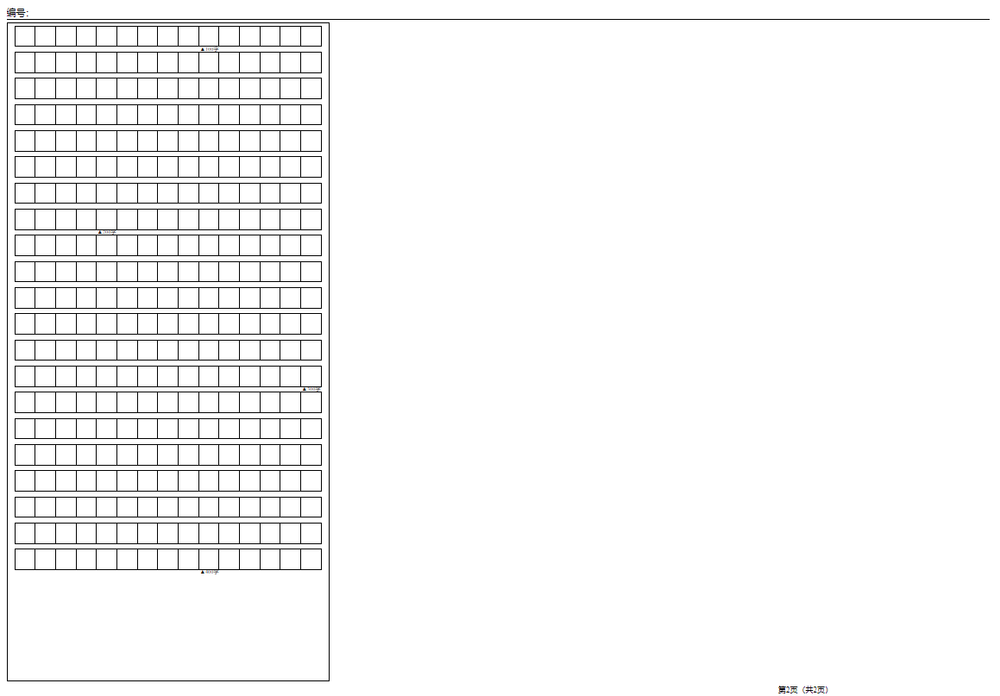

[📘使用文档]() |
[🛠安装教程]() |
[👀模型库]() |
[🆕更新日志]() |
[🚀进行中的项目]() |
[🤔报告问题]()

## 答题卡识别业务问题集合
    
1.阅卷方式中提供了纸阅卡和网阅卡两种方式，两种方式下纸阅卡和网阅卡的选做题的得分方式表示不一致，上图是纸阅卡的得分方式，可不采用老师扣分的形式，而是直接选分？

      
2.再次确认下是否可以返回单题坐标？

3.阅卷方式这一侧的信息是否都可以返给算法？

   
    
4.单题的页面超过了一页/栏，如何提供左上角坐标？

5.输入答题卡图片可能是单张，输入模板结构信息是以一张图对应一个模板信息，还是整个答题卡的的模板结构信息？

6.框关键点定位以及版式要求        
1.每一栏要加框，框颜色各异          
2.每一页要加框，框颜色各异             
3.框加标识符点，每页或者每栏均设计四个固定矫正点坐标，纵向每1/3处加一个圆点，每页共有四个评估坐标              

7.确定版式之后，要将标识符点的坐标传入，此外当确定板式之后，则由一版式产生的左上角标识符的位置是固定的。

